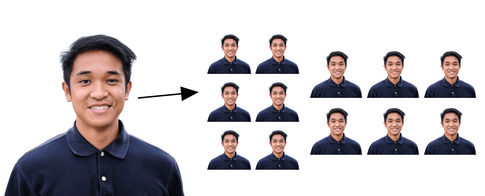

# US Passport 4x6 Photo Template Tool
Convert your cropped Passport Photo into a 4x6 Photo format to cheaply print!

# Situation
I was helping my parents renew their passport and took their passport photos for them. I didn't have a photo printer at home so I wanted to print the photos at Walgreens or CVS. I soon realized that you can't just print a singular square photo. So I searched for online tools to quickly make a 4x6 photo to upload to their site. A [quick google search](https://www.google.com/search?q=4x6+passport+photo&safe=active&client=safari&rls=en&sxsrf=AOaemvJb-TN2TeRmO8r8g-26mxdz1EXNrw%3A1641755736753&ei=WDTbYe28LauxytMPiKSooAQ&ved=0ahUKEwjtyPzbsKX1AhWrmHIEHQgSCkQQ4dUDCA0&oq=4x6+passport+photo&gs_lcp=Cgdnd3Mtd2l6EAwyBwgjELADECcyBwgjELADECcyBwgAEEcQsAMyBwgAEEcQsAMyBwgAEEcQsAMyBwgAEEcQsAMyBwgAEEcQsAMyBwgAEEcQsAMyBwgAEEcQsAMyBwgAEEcQsANKBAhBGABKBAhGGABQAFgAYJQIaAFwAngAgAEAiAEAkgEAmAEAyAEKwAEB&sclient=gws-wiz) offered tools, but all of them seemed sketchy and unecessary to upload photos to their servers. 
**I didn't want to do any fancy editing, just a simple tool to convert a single square into a multiple photos in a 4x6 format.**

# Task
Create a simple online web app to convert a square photo into a 4x6 format with multiple photos to print at Walgreens/CVS. Everything should be on done locally. There should be no external libraries.

# Action
Create the skeleton html elements. 
Use Javascript to handle:
* The initial photo file upload.
* Only allow JPEGs (only allowing compressed files means smaller filesizes compared to other photo types)
* Only allow square photos (I don't feel like making a whole image editor at the moment...)
* Resize the square photo if its large. Max size is 1080x1080
* Handle new photo uploads.
* Handle invalid files.
* Show the uploaded photo.
* Create the 4x6 photo depending on selected orientation.
* Show the 4x6 photo.
* Toggle between portrait and landscape orientations.
* Allowing the user to download their 4x6 photo (aka convert the canvas to a photo)
Finally add some basic css styling.

# Result
Using the [U.S. Passport Photos tool]("https://tsg.phototool.state.gov/photo"), I created my parent's passport photo. Then I can upload it to this web-app and everything is done locally. I downloaded the 4x6 photo and uploaded it to walgreens, which cost less than $1. 

I made this app for a nice little web dev project. Funny I found [another site](https://www.oddprints.com/passport) that does what I do. Better UI but only does the landscape orientation and two photos. 